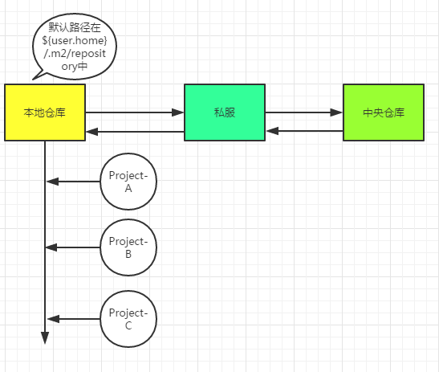

# 前言
在如今的互联网项目开发当中，特别是Java领域，可以说Maven随处可见。Maven的仓库管理、依赖管理、继承和聚合等特性为项目的构建提供了一整套完善的解决方案，可以说如果你搞不懂Maven，那么一个多模块的项目足以让你头疼，依赖冲突就会让你不知所措，甚至搞不清楚项目是如何运行起来的.....OK，博主就曾经被Maven“伤害”过，那么该专题的目的就是：彻底搞定Maven！
> 回想一下，当你新到一家公司，安装完JDK后就会安装配置Maven（MAVEN_HOME、path），很大可能性你需要修改settings.xml文件，比如你会修改本地仓库地址路径，比如你很可能会copy一段配置到你的settings.xml中（很可能就是私服的一些配置）。接下来，你会到IDEA或者Eclipse中进行Maven插件配置，然后你就可以在工程中的pom.xml里面开始添加<dependency>标签来管理jar包，在Maven规范的目录结构下进行编写代码，最后你会通过插件的方式来进行测试、打包（jar or war）、部署、运行。

上面描述了我们对Maven的一些使用方式，下面我们进行一些思考：
### 1. 本地仓库？Maven到底有哪些仓库？它们有什么关系？

```xml
<localRepository>D:\Develop\repository</localRepository>
```
> 你要jar包，不可能每次都要联网去下载吧，多费劲，所以本地仓库就是相当于加了一层jar包缓存，先到这里来查。如果这里查不到，那么就去私服上找，如果私服也找不到，那么去中央仓库去找，找到jar后，会把jar的信息同步到私服和本地仓库中。  
  私服，就是公司内部局域网的一台服务器而已，你想一下，当你的工程Project-A依赖别人的Project-B的接口，怎么做呢？没有Maven的时候，当然是copy Project-B jar到你的本地lib中引入，那么Maven的方式，很显然需要其他人把Project-B deploy到私服仓库中供你使用。因此私服中存储了本公司的内部专用的jar！不仅如此，私服还充当了中央仓库的镜像，说白了就是一个代理！  
  中央仓库：该仓库存储了互联网上的jar，由Maven团队来维护，地址是：http://repo1.maven.org/maven2/。
 
### 2.关于<dependency>的使用 
```xml
<dependency>
    <groupId>org.apache.commons</groupId>
    <artifactId>commons-lang3</artifactId>
    <version>3.6</version>
</dependency>
```
> 其实这个标签揭示了jar的查找坐标：groupId、artifactId、version。  
一般而言，我们可以到私服上输入artifactId进行搜索，或者到http://search.maven.org/、http://mvnrepository.com/上进行查找确定坐标。  

#### version分为开发版本（Snapshot）和发布版本（Release），那么为什么要分呢？
> 在实际开发中，我们经常会遇到这样的场景，比如A服务依赖于B服务，A和B同时开发，B在开发中发现了bug,修改后，
将版本由1.0升级为2.0，那么A必须也跟着在pom.xml中进行版本升级。过了几天后，B又发现了问题，进行修改后升级
版本发布，然后通知A进行升级...可以说是开发过程中的版本不稳定导致了这样的问题。  
Maven，已经替我们想好了解决方案，就是使用snapshot版本，在开发过程中B发布的版本标志为snapshot版本，A进行
依赖的时候选择snapshot版本，那么B发布的话，会在私服仓库中，形成带有时间戳的snapshot版本，而A后见的时候会
自动下载B最新时间戳的snapshot版本。

### 3. 既然Maven进行了依赖管理，为什么还会出现依赖冲突？处理依赖冲突的手段是？
```xml
<dependency>
    <groupId>org.apache.commons</groupId>
    <artifactId>commons-lang3</artifactId>
    <version>3.7</version>
</dependency>

<dependency>
    <groupId>org.apache.commons</groupId>
    <artifactId>commons-lang3</artifactId>
    <version>3.6</version>
</dependency>
```
> 首先来说，对于Maven而言，同一个groupId同一个artifactId下，只能使用一个version！  
根据上面的以来顺序，将使用3.6版本的jar。  
现在我们可以思考下了，比如工程中需要引入A、B，而A依赖1.0版本的C，B依赖2.0版本的C，那么问题来了，C使用的版本
将由引入A、B的顺序而定？这显然不靠谱！如果A的依赖写在B的依赖的后面，将意味着最后引入的是1.0版本的C，很可能在
运行阶段出现类（ClassNotFoundException）、方法（NoSuchMethodError）找不到的错误（因为B使用的是高版本的C）。  

这里其实涉及到两个概念：依赖传递（transitive）、Maven的最近依赖策略。  

Maven的最近以来策略：如果一个项目依赖相同的groupId、artifactId的多个版本，那么在依赖树（mvn:dependency:tree）
中离项目最近的那个版本将会被使用。（从这里可以看出Maven是不是有点小问题呢？能不能选择高版本的进行依赖呢？据了解，
Gradle就是version+策略）  

现在，我们可以想想如何处理依赖冲突呢？  
想法1：要使用哪个版本，我们是清楚的，那么能不能不管如何依赖传递，都可以进行版本锁定呢？  
使用`<dependencyManagement>`[这种主要用于子模块的版本一致性中]  

想法2：在依赖传递中，能不能去掉我们不想依赖的？  
使用`exclusions`[在实际中我们可以在IDEA中直接利用插件帮助我们生成]  

想法3：既然是最近依赖策略，那么我们就直接使用显式依赖指定版本，那不就是最靠近项目的么？
使用`<dependency>`

想法4：上面说的所有解决办法都是最终选择一个版本进行解决，但我们可能需要同一个软件报的两个版本共存而不能冲突，这
在项目管理上叫“钻石依赖”。Maven的“扁平化”依赖管理方式，会从多个冲突的版本中选择一个来使用，如果不同的版本之间
兼容性很糟糕，那么程序将无法正常编译运行。  
使用ClassLoader可以解决钻石依赖的问题。不同版本的软件包使用不同的ClassLoader来加载，位于不同ClassLoader中名
称一样的类实际上是不同的类。下面让我们使用URLClassLoader来尝试一个简单的例子，它默认的父加载器是AppClassLOader
```java
// cat ~/source/jcl/v1/Dep.java
public class Dep {
    public void print() {
        System.out.println("v1");
    }
}

// cat ~/source/jcl/v2/Dep.java
public class Dep {
    public void print() {
        System.out.println("v1");
    }
}

// cat ~/source/jcl/Test.java
public class Test {
    public static void main(String[] args){
        String v1dir = "file:\\Users\xxx\source\jcl\v1";
        String v2dir = "file:\\Users\xxx\source\jcl\v2";
        URLClassLoader v1 = new URLClassLoader(new URL[]{new URL(v1dir)});
        URLClassLoader v2 = new URLClassLoader(new URL[]{new URL(v12dir)});
        
        Class<?> depv1Class = v1.loadClass("Dep");
        Object depv1 = depv1Class.getConstructor().newInstance();
        depv1Class.getMethod("print").invoke(deptv1);
        
        Class<?> depv2Class = v2.loadClass("Dep");
        Object depv2 = depv2Class.getConstructor().newInstance();
        depv2Class.getMethod("print").invoke();
        
        System.out.println(depv1Class.equals(depv2Class));
    }
}
```
在运行之间，我们需要对依赖的库进行编译
```ecmascript 6
$ cd ~/source/jcl/v1
$ javac Dep.java
$ cd ~/source/jcl/v2
$ javac Dep.java
$ cd ~/source/jcl
$ javac Test.java
$ java Test
v1
v2
false
```
在这个例子中如果两个URLClassLoader指向的路径是一样的，下面这个表达式还是false，因为即使是同样的字节码
用不同的ClassLoader加载出来的类都不能算同一个类。
```java
depv1Class.equals(depv2Class);
//false
```
我们还可以让两个不同版本的Dep类实现同一个接口，这样可以避免使用反射的方式来调用Dep类里面的方法。
```java
Class<?> depv1Class = v1.loadClass("Dep");
IPrint depv1 = (IPrint)depv1Class.getConstructor().newInstance();
depv1.print();
```
ClassLoader 固然可以解决依赖冲突问题，不过它也限制了不同软件包的操作界面必须使用反射或接口的方式进行动态调用。  
Maven 没有这种限制，它依赖于虚拟机的默认懒惰加载策略，运行过程中如果没有显示使用定制的 ClassLoader，那么从头到尾都是在使用 AppClassLoader，  
而不同版本的同名类必须使用不同的 ClassLoader 加载，所以 Maven 不能完美解决钻石依赖。
如果你想知道有没有开源的包管理工具可以解决钻石依赖的，我推荐你了解一下 sofa-ark，它是蚂蚁金服开源的轻量级类隔离框架。
> 简介：当引入二方依赖包或三方依赖包时，可能出现外部依赖jar包与自己的工程需要依赖的冲突，或者多个二方三方依赖包互相冲突。  
这时候就需要一个隔离容器对他们进行隔离，其依赖的原理就是jvm认为不同classloader加载的类即使包名类名相同，也认为他们是不同的。  
sofa-ark将需要隔离的jar包打成plugin，对每个plugin都用独立的classloader去加载。

> 使用的基本步骤：
> 1. 在会发生冲突的jar包的POM文件加入sofa-ark提供的maven插件，将其打成特定格式的jar包（plugin）。
> 2. 在外部工程按照约定引入jar包。如果外部工程想打包成可执行的jar（fat-jar），还需要加入特定的maven插件。
> 3. 直接运行。

> maven下篇：Profile/Filter特性，多模块开发以及私服。https://www.jianshu.com/p/34740cd1fb58

