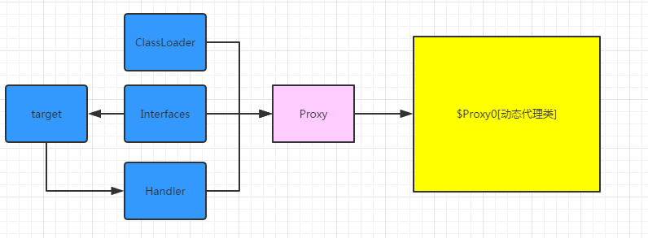

## 1.  一个简单的JDK动态代理实例
```java
// 1. 首先定义一个业务接口，jdk动态代理中，被代理类必须实现接口
public interface Man{
    //接口中只有一个方法，找对象。
    void findObject();
}

// 2. 定义一个实现类
public class Xmisaka implements Man {
    @Override
    public void findObject(){
        System.out.println("Hi, my girl, I'll find you. ");
    }   
}

// 3. 定义一个业务处理器
public class StudyHandler implements InvocationHandler {
    private Man man;
    public StudyHandler(Man man){
        this.man = man;
    }
    
    @Override
    public Object invoke(Object proxy, Method method, Object[] args){
        before();
        Object result = method.invoke(man,null);
        after();
        return result;
    }  
    
     private void before() {
        System.out.println("制定学习计划！");
     }
    
     private void after() {
        System.out.println("学习结束，打游戏去。");
     }
}

// 4. 编写业务类，测试代码
public class ProxyTest{
    public static void main(String[] args){
        Man xmisaka = new Xmisaka();
        InvocationHanler studyHandler = new StudyHandler(xmisaka);
        Class<?> cls = Xmisaka.getClass();
        /**
         * 第一个参数：传入被代理对象的类加载器，用来加载生成的代理类的字节码文件$Proxy0
         * 第二个参数：JDK动态代理是面向接口的，这里要传入的是哪些接口需要被代理，接口中声明的方法将会被融入到新生成的代理对象中
         * 第三个参数：业务处理对象，最终都会调用该对象中的invoke方法，进行业务处理
         */
        Man proxyMan = (Man) Proxy.newProxyInstance(cls.getClassLoader(), cls.getInterfaces(), studyHandler);
        proxyMan.findObject();
    }
} 

```
使用jdk动态代理步骤：
1. 创建被代理的接口和类
2. 创建InvocationHandler接口的实现类，在invoke方法中实现代理逻辑
3. 通过proxy的静态方法newProxyInstance（ClassLoader  loader, Class[] interfaces, InvocationHandler h）创建一个代理对象
4. 使用代理对象。

JDK动态代理的原理图：

说白了，动态代理的过程是这样的：
1. Proxy通过传递参数给它参数（interfaces/invocationHandler）生成代理类$Proxy0;
2. Proxy通过传递给它的参数(ClassLoader)来加载生成的代理类$Proxy0的字节码文件
