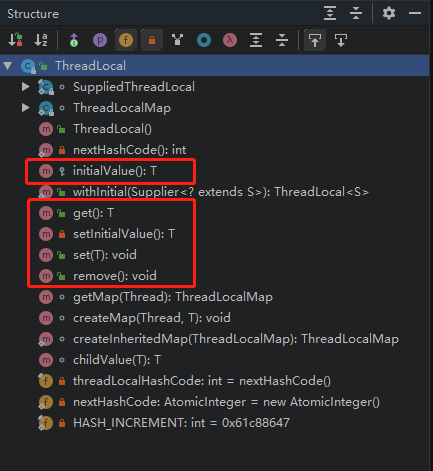
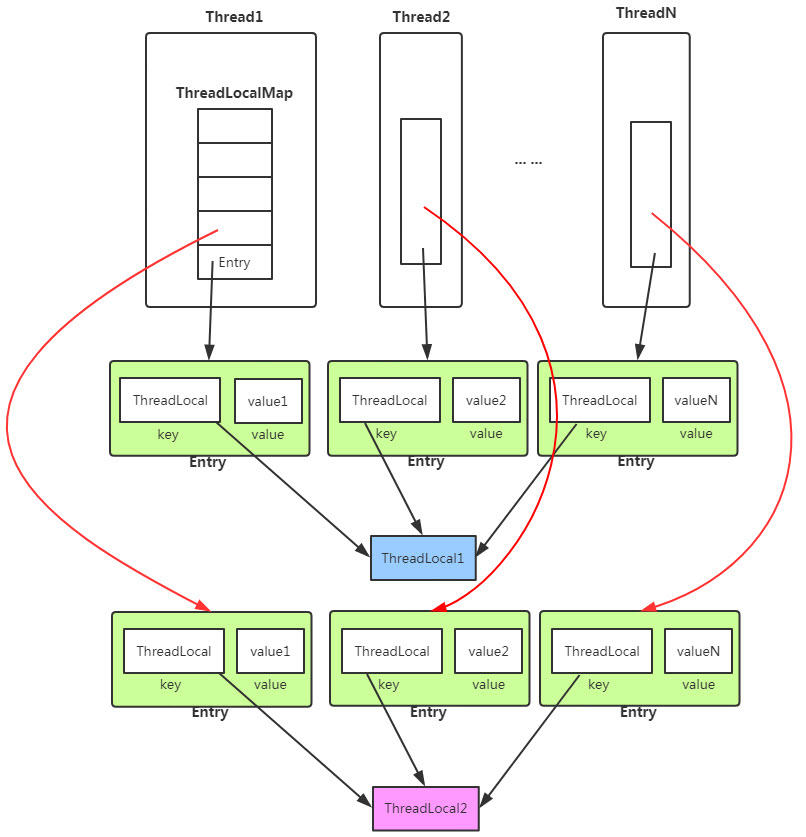
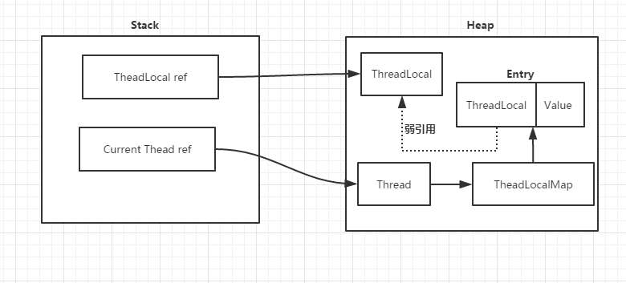

## ThreadLocal 是什么、有什么、能做什么？
> ThreadLocal提供一个线程（Thread）局部变量，访问某个变量的每一个线程都拥有自己的局部变量。说白了，ThreadLocal就是想在多线程环境下区保证成员变量的安全。  
ThreadLocal是一个本地线程副本变量工具类。主要用于将私有线程和该线程存放的副本对象做一个映射，各个线程之间的变量互不干扰，在高并发场景下，
可以实现无状态的调用，特别适用于各个线程依赖不通的变量值完成操作的场景。
ThreadLocal提供的方法；  

> 对于ThreadLocal而言，常用的方法，就是get/set/remove方法。
我们先来看一个例子：
```java
package Thread;

/**
 * @author xmisaka
 * @create 2019-07-15 16:15
 */
public class Test {
    private static A a = new A();
    private static final ThreadLocal<A> threadLocal = new ThreadLocal<A>() {
        protected A initialValue() {
            return a;
        }
    };

    public static void main(String[] args) {
        Thread[] threads = new Thread[5];
        for (int i = 0; i < 5; i++) {
            threads[i] = new Thread(() -> {
                threadLocal.get().setNumber(threadLocal.get().getNumber() + 5);
                System.out.println(Thread.currentThread().getName() + ":" + threadLocal.get().getNumber());
            }, "Thread-" + i);
        }
        for (Thread thread : threads) {
            thread.start();
        }
    }

}

class A {
    private int number = 0;

    public int getNumber() {
        return number;
    }

    public void setNumber(int nubmer) {
        this.number = nubmer;
    }
}

```
运行结果：
```ecmascript 6
Thread-0:10
Thread-4:25
Thread-2:15
Thread-3:20
Thread-1:10
```
> 很显然，在这里，并没有通过ThreadLocal达到线程隔离的机制，可是ThreadLocal不是保证线程安全的么？这是什么鬼？  
虽然，ThreadLocal让访问某个变量的线程都拥有自己的局部变量，但是如果这个局部变量都指向同一个对象呢？这个时候ThreadLocal就失效了。
仔细观察下图中的代码，就会发现，threadLocal在初始化时返回的都是同一个对象a。

## 从数据结构入手：   
下面为ThreadLocal的内部结构图  

从上面的结构图，我们已经窥见ThreadLocal的核心机制：
- 每个Thread线程内部都有一个Map。
- Map里面存储线程本地对象（key）和线程的变量副本（value）。
- 但是，Thread内部的Map是由ThreadLocal维护的，由ThreadLocal负责向map获取和设置线程的变量值。
所以对于不同的线程，每次获取副本值时，别的线程并不能获取到当前线程的副本值，形成了副本隔离，互不干扰。  
Thread线程内部的Map在类中描述如下：
```java
public class Thread implements Runnable {
    /* ThreadLocal values pertaining to this thread. This map is maintained
     * by the ThreadLocal class. */
    ThreadLocal.ThreadLocalMap threadLocals = null;
}
```
## 深入解析ThreadLocal
ThreadLocal类提供如下几个核心方法：  
```java
public T get()
public void set(T value)
public void remove()
```
- get()方法用于获取当前线程的副本变量值。
- set()方法用于保存当前线程的副本变量值。
- initialValue()为当前线程初始副本变量值。
- remove()方法移除当前前程的副本变量值。

#### get()方法
```java
/**
 * Returns the value in the current thread's copy of this
 * thread-local variable.  If the variable has no value for the
 * current thread, it is first initialized to the value returned
 * by an invocation of the {@link #initialValue} method.
 *
 * @return the current thread's value of this thread-local
 */
public T get() {
    Thread t = Thread.currentThread();
    ThreadLocalMap map = getMap(t);
    if (map != null) {
        ThreadLocalMap.Entry e = map.getEntry(this);
        if (e != null)
            return (T)e.value;
    }
    return setInitialValue();
}

ThreadLocalMap getMap(Thread t) {
    return t.threadLocals;
}

private T setInitialValue() {
    T value = initialValue();
    Thread t = Thread.currentThread();
    ThreadLocalMap map = getMap(t);
    if (map != null)
        map.set(this, value);
    else
        createMap(t, value);
    return value;
}

protected T initialValue() {
    return null;
}
```
步骤：
1. 获取当前线程的ThreadLocalMap对象threadLocals
2. 从map中获取线程存储的K-V Entry节点。
3. 从Entry节点获取存储的Value副本值返回。
4. map为空的话返回初始值null，即线程变量副本为null，在使用时需要注意判断NullPointerException。

#### set()方法
```java
/**
 * Sets the current thread's copy of this thread-local variable
 * to the specified value.  Most subclasses will have no need to
 * override this method, relying solely on the {@link #initialValue}
 * method to set the values of thread-locals.
 *
 * @param value the value to be stored in the current thread's copy of
 *        this thread-local.
 */
public void set(T value) {
    Thread t = Thread.currentThread();
    ThreadLocalMap map = getMap(t);
    if (map != null)
        map.set(this, value);
    else
        createMap(t, value);
}

ThreadLocalMap getMap(Thread t) {
    return t.threadLocals;
}

void createMap(Thread t, T firstValue) {
    t.threadLocals = new ThreadLocalMap(this, firstValue);
}
```
步骤：
1. 获取当前线程的成员变量map
2. map非空，则重新将ThreadLocal和新的value副本放入到map中。
3. map空，则对线程的成员变量ThreadLocalMap进行初始化创建，并将ThreadLocal和value副本放入map中。

#### remove()方法
```java
/**
 * Removes the current thread's value for this thread-local
 * variable.  If this thread-local variable is subsequently
 * {@linkplain #get read} by the current thread, its value will be
 * reinitialized by invoking its {@link #initialValue} method,
 * unless its value is {@linkplain #set set} by the current thread
 * in the interim.  This may result in multiple invocations of the
 * <tt>initialValue</tt> method in the current thread.
 *
 * @since 1.5
 */
public void remove() {
 ThreadLocalMap m = getMap(Thread.currentThread());
 if (m != null)
     m.remove(this);
}

ThreadLocalMap getMap(Thread t) {
    return t.threadLocals;
}
```

在ThreadLocalMap中，也是用Entry来保存K-V结构数据的。但是Entry中key只能是ThreadLocal对象，这点被Entry的构造方法已经限定死了。  
```java
static class Entry extends WeakReference<ThreadLocal> {
    /** The value associated with this ThreadLocal. */
    Object value;

    Entry(ThreadLocal k, Object v) {
        super(k);
        value = v;
    }
}
```
Entry继承自WeakReference（弱引用，生命周期只能存活到下次GC前），但只有Key是弱引用类型的，Value并非弱引用。

ThreadLocalMap的成员变量：
```java
static class ThreadLocalMap {
    /**
     * The initial capacity -- MUST be a power of two.
     */
    private static final int INITIAL_CAPACITY = 16;

    /**
     * The table, resized as necessary.
     * table.length MUST always be a power of two.
     */
    private Entry[] table;

    /**
     * The number of entries in the table.
     */
    private int size = 0;

    /**
     * The next size value at which to resize.
     */
    private int threshold; // Default to 0
}
```
#### Hash冲突怎么解决
和HashMap的最大的不同在于，ThreadLocalMap结构非常简单，没有next引用，也就是说ThreadLocalMap中解决Hash冲突的方式并非链表的方式，而是采用线性探测的方式。  
所谓线性探测，就是根据初始key的hashcode值确定元素在table数组中的位置，如果发现这个位置上已经有其他key值的元素被占用，则利用固定的算法寻找一定步长的下个位置，依次判断，直至找到能够存放的位置。  

ThreadLocalMap解决Hash冲突的方式就是简单的步长加1或减1，寻找下一个相邻的位置。
```java
/**
 * Increment i modulo len.
 */
private static int nextIndex(int i, int len) {
    return ((i + 1 < len) ? i + 1 : 0);
}

/**
 * Decrement i modulo len.
 */
private static int prevIndex(int i, int len) {
    return ((i - 1 >= 0) ? i - 1 : len - 1);
}
```
### 总结
1. ThreadLocalMap中的Entry弱引用（key）到的是 threadLocal 对象，
此处的弱引用意图是，当外界不再持有对 threadLocal 对象的强引用的时候，
threadLocal 对象可以被GC。此处Entry对 threadLocal 的弱引用不会引起内存泄露。

2. Entry除了持有对threadLocal的弱引用之外还持有对value的强引用。
先说为什么调用了threadLocal.remove() 就解决了内存泄漏的风险。
threadLocal.remove() 这个方法最终会有机会执行到：  
entry.value = null;  
entry = null;  
这样就解除了entry对value的强引用关系，当外部也没有对value的强引用的时候，
value就可以被GC。

    如果不调用threadLocal.remove() 这个方法，其实也是要分情况来考虑的。  
我们知道 entry 是被 threadLocalMap 引用的；而 threadLocalMap 是被 thread 引用的。  
如果一个thread执行完毕，进入 TERMINATED 状态时，作为一种GC Root，terminated 状态的 thread本身就是可以被GC的。那么thread所引用的 threadLocalMap 也就是可以被GC的。

    那么什么情况下 threadLocalMap 不能被回收呢？那就是thread并不会进入 terminated 状态的时候。  
什么时候不进入 terminated 呢？就是当 thread 配合线程池使用的情况下，thread在运行完毕之后
会被再次放回线程池。  
那么如果这个线程永远不被用到，此处的threadLocalMap 包括entry 和 entry引用的value 就不能被回收了。
那么如果这个线程被再次启用，那么threadLocalMap也就不会再重新初始化了。  
此处应该考虑另外一个问题，那就是如果再次调用 threadLocal.get() 方法，得到的是上一次set的内容，
也就是脏读了。  
> web容器中（tomcat）的线程时重复使用的，web容器使用了线程池，当一个请求使用完某个线程，该线程会放回线程池被其他请求使用，
这就导致一个问题，不同的请求还是有可能会使用到同一个线程（只要请求数量大于线程池线程数量）。  
而ThreadLocal是属于线程的，如果我们使用完ThreadLocal对象而没有手动删除，那么后面的请求就有机会使用到被使用过的ThreadLocal对象。  
如果一个请求在使用ThreadLocal的时候，是先get()来判断然后再set()，那就会有问题，因为get到的是别的请求set的内容；  
如果一个请求每次使用ThreadLocal，都是先set再get，那就不会有问题，因为一个线程同一时刻只被一个请求使用，只要我们每次使用之前，
都设置成自己想要的内容，那就不会在使用的过程中被覆盖。使  
用ThreadLocal最好是每次使用完就调用remove方法，将其删掉，避免先get后set的情况导致业务的错误。

一个简单的使用例子：
```java
package com.yonyou.ocm.common.datapermission;
/**
 * @author xmisaka
 * @create 2019-04-18 13:08
 */
public class BusinessTypeThreadLocal {

    private static final ThreadLocal<String> INSTANCE = new ThreadLocal<>();

    private BusinessTypeThreadLocal(){}

    public static ThreadLocal getInstance() {
        return INSTANCE;
    }
}

//设置线程变量值
BusinessTypeThreadLocal.getInstance().set("baseGoods");
//获取线程变量值
String businessType = (String) BusinessTypeThreadLocal.getInstance().get();
//用完之后remove
BusinessTypeThreadLocal.getInstance().remove();
```                                                      

### ThreadLocal内存泄漏问题分析  
在JAVA里面，存在强引用、弱引用、软引用、虚引用。这里主要谈一下强引用和弱引用。  
强引用，就不必说了，类似于：  
A a = new A();  
B b = new B();  
考虑这样的情况：  
C c = new C(b);  
b = null;  
考虑下GC的情况。要知道b被置为null，那么是否意味着一段时间后GC工作可以回收b所分配的内存空间呢？答案是否定的，因为即便b被置为null，但是c仍然持有对b的引用，而且还是强引用，所以GC不会回收b原先所分配的空间！既不能回收利用，又不能使用，这就造成了内存泄露。
那么如何处理呢？  
可以c = null;也可以使用弱引用！（WeakReference w = new WeakReference(b);）    
分析到这里，我们可以得到：  

这里我们思考一个问题：ThreadLocal使用到了弱引用，是否意味着不会存在内存泄露呢？  
> 首先来说，如果把ThreadLocal置为null，那么意味着Heap中的ThreadLocal实例不在有强引用指向，只有弱引用存在，因此GC是可以回收这部分空间的，也就是key是可以回收的。  
但是value却存在一条从Current Thread过来的强引用链。因此只有当Current Thread销毁时，value才能得到释放。  
>
>  因此，只要这个线程对象被gc回收，就不会出现内存泄露，但在threadLocal设为null和线程结束这段时间内不会被回收的，就发生了我们认为的内存泄露。最要命的是线程对象不被回收的情况，比如使用线程池的时候，线程结束是不会销毁的，再次使用的，就可能出现内存泄露。
>
>  那么如何有效的避免呢？  
>
> 事实上，在ThreadLocalMap中的set/getEntry方法中，会对key为null（也即是ThreadLocal为null）进行判断，如果为null的话，那么是会对value置为null的。我们也可以通过调用ThreadLocal的remove方法进行释放！
